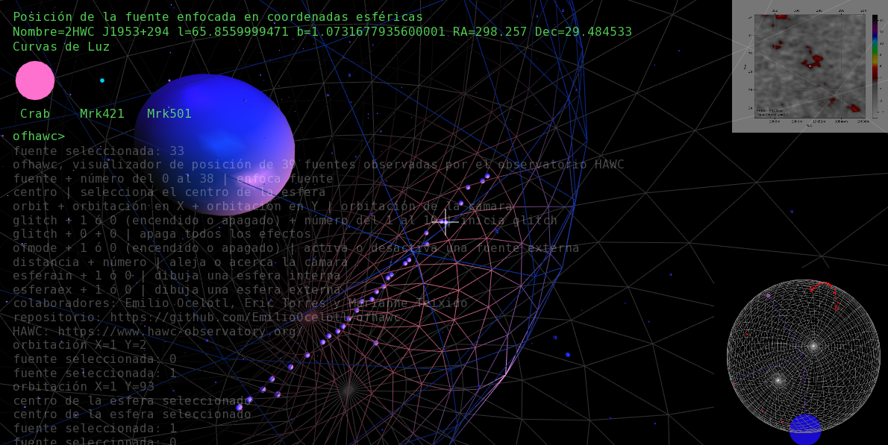

# ofhawc

## Introducción

Visualizador basado en [OpenFrameworks][1] de los datos de posición y curvas de luz de fuentes observadas. Estos datos fueron recopilados por el [Observatorio de Rayos Gamma HAWC][2] (High-Altitude Water Cherenkov Gamma-Ray Observatory). El proyecto surge a propósito del [Hackatón Astronómico][3] y es parte de un proyecto colaborativo que se complementa con [2HAWC][4] y [sc_hawc][5] y parte de la práctica performática del [Live Coding][6].

## Colaboradorxs

Emilio Ocelotl, Eric Torres, Marianne Teixido. Con el apoyo de Rodrigo Treviño. 

## Ejecución

El proyecto ha sido probado en Linux (OF 0.10.0) y Mac (OF 0.9.8). Requiere de ofxPostGlitch y de ofxSyphon (solo Mac). Para el caso de Linux, es necesario eliminar la línea ofxSyphon del archivo addons.make. Por alguna extraña razón, enfocar una fuente no es posible en Linux. 

En la carpeta bin/data/ es posible encontrar los archivos complementarios al proyecto de OpenFrameworks. En la carpeta csv es posible encontrar los datos que el proyecto recupera. En la carpeta sc están los archivos de SuperCollider que son necesarios para enviar la secuencia de las curvas de luz y el extracto de texto que envía lo declarado en SuperCollider a OpenFrameworks a través de History. 

## Descripción

Cada objeto visible es una fuente y su localización en el espacio tridimensional está determinada por la traspolación de la posición en coordenadas galácticas a coordenadas esféricas. El posicionamiento de las fuentes en un espacio tridimensional permite realizar acercamientos de cámara de cada fuente. Los acercamientos arrojan información en forma de texto del objeto enfocado. Es posible enfocar el objeto a partir de un comando que puede ser escrito en la mini-consola del visualizador. Ej: fuente 1. 

La posición de las fuentes en un espacio tridimensional fue posible gracias a la traspolación de coordenadas galácticas a coordenadas esféricas. Para realizar esto fue necesario utilizar los datos públicos del proyecto HAWC para generar nuevos datos que pudieran ser utilizados en un entorno de trabajo como OpenFrameworks o Processing. Esta generación de datos a partir de otros existentes se realizó con [Astropy][7].

El visualizador está pensado para ejecutarse a la par de un complemento sonoro realizado en SuperCollider. El motor de audio extrae y secuencia los valores de las curvas de luz. Posteriormente estos son enviados a OF para ser representados en forma de intensidad lumínica. Esta representación no tiene su correspondencia para cada fuente ya que solamente hay datos para tres fuentes observadas. La parte de audio utiliza una serie de 39 sintetizadores asignados cada uno a una fuente en específico y los valores de amplitud están relacionados a la fuente enfocada (el resto queda "sonando" como ruido de fondo con una amplitud menor).

Este proyecto se inspira parcialmente en [Orbit][8], una plataforma para realizar [Live Coding][9] e integrarlo con audio y video. Debido a esto, es posible escribir texto en pantalla para controlar distintos parámetros del sistema. Por otro lado, el complemento de audio utiliza la librería [JITLib][10], lo cual permite la manipulación dinámica de los flujos de información que representan las curvas de luz. 

## Conclusiones

El mayor reto al visualizar/sonorizar datos tiene que ver con la representación de un fenómeno en escalas humanamente perceptibles. Si tomamos en cuenta esta situación, interfaces de visualización/sonorización como ofhawc funcionan como una especie de prótesis que nos ayuda a tener una aproximación en escala humana a la emisión de rayos gamma.

Es importante señalar que esta aproximación está mediada por decisiones relacionadas con la experiencia de los involucrados en el desarrollo e implementación del proyecto. La aproximación al fenómeno se ve en cierta medida distorsionada por estas decisiones. Otro de los retos a los que nos enfrentamos fue encontrar una mediación entre las decisiones estéticas y la utilización estricta de los datos.

El modelo bidireccional de intercambio de información nos permite aprovechar las posibilidades de OpenFrameworks y SuperCollider. Por un lado, encontramos cómodo trabajar las estructuras fijas de datos en OpenFrameworks, mientras que los datos secuenciados en un continuo de tiempo son más fáciles de manipular en SuperCollider. 

El trabajo con múltiples plataformas (OF, SC, P) nos permitió conducir de manera colectiva la comprensión y la realización del objetivo final. 

El sistema permite "livecodear" los datos en vivo. Gracias a esto es posible tener una experiencia performática de aproximación a los datos del HAWC. 

## Trabajo pendiente

- Representaciones tridimensionales de las fuentes. 
- Búsqueda del vecino más cercano para determinar las relaciones en el espacio de las fuentes. 
- Integración con los otros equipos del hackatón astronómico. 
- Lograr enfocar fuentes en Linux.
- Un modo dedicado a las curvas de luz. Revisar [Canon Generator][11]. 

[1]: https://openframeworks.cc/
[2]: https://www.hawc-observatory.org/
[3]: http://artecienciaytecnologias.mx/es/programacion/divulgacion/5121748WQHs766EB9yOj0146
[4]: https://github.com/ciretorres/2HAWC
[5]: https://github.com/marianneteixido/sc_hawc
[6]: http://www.hernanivillasenor.com/archivos/html/livecoding.html
[7]: http://www.astropy.org/
[8]: https://github.com/EmilioOcelotl/Orbit
[9]: https://toplap.org/about/
[10]: http://doc.sccode.org/Overviews/JITLib.html
[11]: https://github.com/nanc-in-a-can/canon-generator